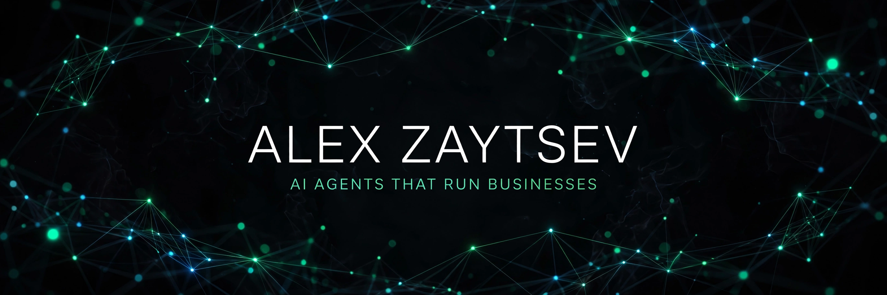

  

  &nbsp;
  &nbsp;
  &nbsp;
  

---

### What I build

I'm Alex, founder of [Robota](https://robota.sh), an AI studio that ships production systems for real businesses: autonomous agents, custom software, web apps and stores, marketing automation, and 3D web experiences.

Before the studio: seven years keeping streaming products shipping. ProdOps, release management, incident response, QA orgs. Now I write the acceptance criteria *and* the code, and I back it with open source you can inspect.

### Service lines

| Line | What you get | Proof |
|---|---|---|
| **AI agents** | WhatsApp and Telegram operators, lead handling, support automation, quoting engines with real business logic | [Client agent builds](#selected-builds), [openclaw-config](https://github.com/unisone/openclaw-config) |
| **Custom software** | Internal tools, operator consoles, integrations, automation for ops teams | [Selected builds](#selected-builds) |
| **Web apps and e-commerce** | Next.js storefronts and web apps, Stripe payments, auth, admin dashboards | [ai-prompts](https://github.com/unisone/ai-prompts) (prompt systems behind the builds) |
| **Marketing automation** | Meta and Google Ads automation with AI: creative variants, budget rules, reporting pipelines | Private client service |
| **AI social** | Content pipelines, scheduling, and AI-assisted creative for Instagram and X | [@unisone.ai](https://instagram.com/unisone.ai) |
| **3D and web experiences** | Blender automation, Three.js viewers, product configurators | *Pipeline repo shipping soon* |
| **Advanced AI skills** | Reusable agent skills: evals, PR review, code graphs, GraphRAG, research | [claude-toolkit](https://github.com/unisone/claude-toolkit), [openclaw-skill-suite](https://github.com/unisone/openclaw-skill-suite) |

### Featured open source

**Agent infrastructure** — the systems behind the systems:

| Project | What it is |
|---|---|
| [**claude-learner**](https://github.com/unisone/claude-learner) | Every mistake becomes a rule. Analyzes Claude Code sessions and auto-generates CLAUDE.md improvements. On npm. |
| [**self-improving-skills**](https://github.com/unisone/self-improving-skills) | Closed-loop skill maintenance for AI agents: Observe → Inspect → Amend → Evaluate. Zero dependencies. |
| [**openclaw-config**](https://github.com/unisone/openclaw-config) | Production-tested OpenClaw configs: hardening, memory engine, skill routing, agent personas, CI security scanning. |
| [**claude-toolkit**](https://github.com/unisone/claude-toolkit) | Tech-debt scanner, git worktree parallelization, and agent skills (PR review, evals, code graphs, Fable delegation) for AI coding workflows. |

**Business systems** — open tooling with commercial intent:

| Project | What it is |
|---|---|
| [**intel-skill**](https://github.com/unisone/intel-skill) | Market intelligence in seconds: gaps, competitors, sentiment, pricing, trends. No API keys required. |
| [**openclaw-skill-suite**](https://github.com/unisone/openclaw-skill-suite) | Agent skills for operators: GraphRAG, release notes, verified computer-use with frontier models. |
| [**ai-prompts**](https://github.com/unisone/ai-prompts) | 54 battle-tested prompts for Claude, GPT, and Gemini, organized by category. |

### Selected builds

- **WhatsApp-first customer engagement platform** — autonomous lead handling, freight quoting with container-fit logic, branded PDF proposals, real-time operator console
- **Quoting engines** — rule-based pricing with AI-assisted inputs, proposal generation in under a minute
- **Review and reputation ops** — automated review monitoring and response workflows for local businesses

*Client names stay private. The systems speak for themselves.*

### Currently building

- **Client agent builds** — WhatsApp operators, quoting engines, and review ops for real businesses
- **Marketing automation** — Meta and Google Ads with AI creative and budget logic, delivered as a private client service
- **The Self-Improving Claude Code Bundle** — the paid pack combining claude-learner and self-improving-skills with a guided setup
- **claude-learner v2** — MCP-native self-improving agent for Claude Code, on npm

### Stack

  

  &nbsp;
  &nbsp;
  &nbsp;
  &nbsp;
  &nbsp;
  

### Stats

  
  

### Work with me

I take on a small number of builds at a time:

- **AI agents** — WhatsApp/Telegram operators for sales, support, or quoting
- **Web apps and e-commerce** — storefronts and internal tools, Stripe included
- **Marketing automation** — Meta and Google Ads run with AI creative and reporting
- **Custom software** — the unglamorous internal system your ops team actually needs

→ [robota.sh](https://robota.sh) · hello@zaydream.com
